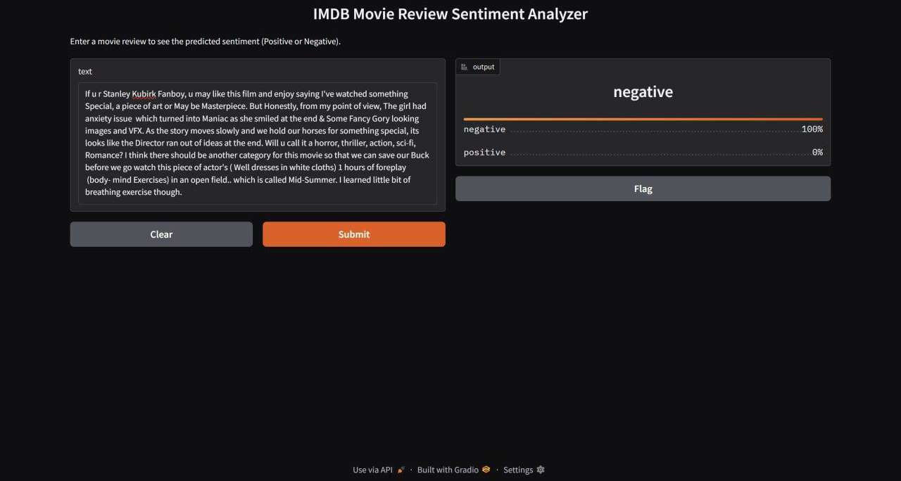
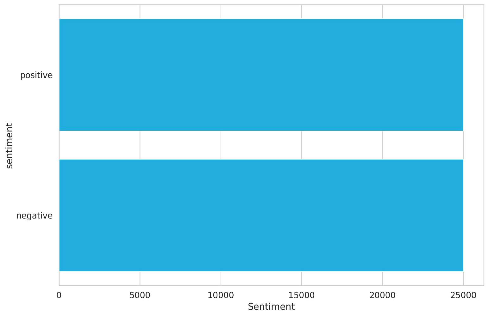
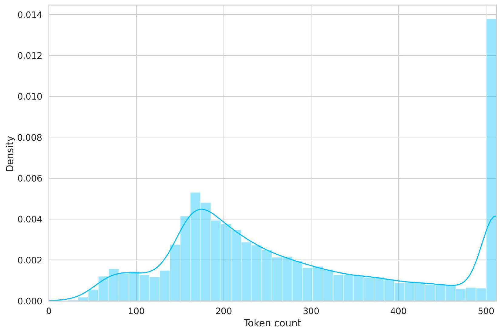
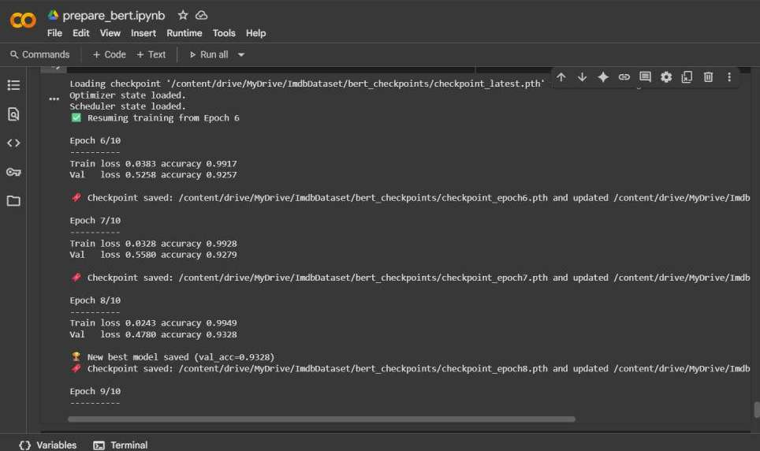
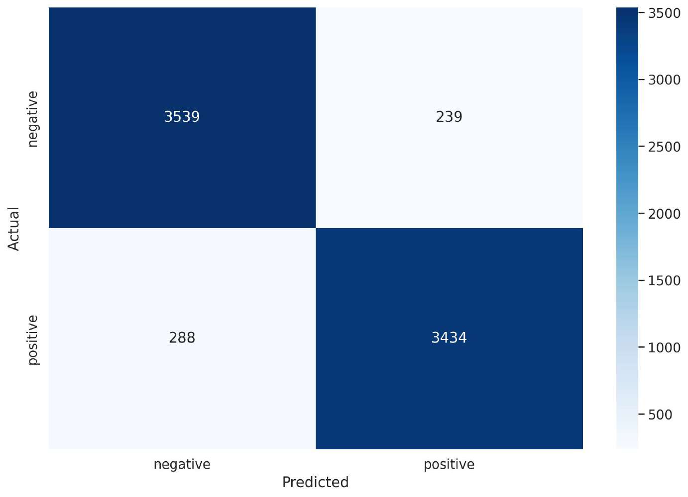

# Sentiment Analysis of IMDb Movie Reviews


An end-to-end Natural Language Processing project for classifying IMDb movie reviews as **positive** or **negative**. The project compares classical machine-learning baselines with a fine-tuned BERT classifier and includes an interactive Gradio demo.

## Demo



The interface accepts a movie review and returns the predicted sentiment with class confidence scores.

## Project overview

Online review platforms contain more feedback than people can evaluate manually. This project transforms unstructured movie-review text into structured sentiment predictions that can support opinion mining, audience analysis, and customer-feedback applications.

The workflow covers:

- exploratory data analysis and data-quality checks;
- text tokenization and sequence-length analysis;
- classical TF-IDF baselines;
- BERT fine-tuning with PyTorch;
- checkpoint recovery for interrupted Colab sessions;
- evaluation using accuracy, precision, recall, F1-score, and a confusion matrix; and
- interactive inference through Gradio.

## Dataset

The project uses the [IMDb Dataset of 50K Movie Reviews](https://www.kaggle.com/datasets/lakshmi25npathi/imdb-dataset-of-50k-movie-reviews).

| Property | Value |
| --- | ---: |
| Total reviews | 50,000 |
| Positive reviews | 25,000 |
| Negative reviews | 25,000 |
| Missing values | 0 |
| Task | Binary sentiment classification |

The balanced class distribution means that accuracy is informative and no over- or undersampling is required.



## Exploratory analysis and preprocessing

Review lengths vary from short comments to several paragraphs. BERT token counts were examined before training, and a maximum sequence length of **400 tokens** was selected to balance information coverage with computational cost.



The BERT preprocessing pipeline performs the following operations:

1. Tokenizes reviews with the `bert-base-cased` WordPiece tokenizer.
2. Adds the required `[CLS]` and `[SEP]` tokens.
3. Truncates long reviews to 400 tokens.
4. Pads shorter reviews to a consistent sequence length.
5. Creates attention masks so padding tokens are ignored.

The dataset is divided into:

- **70% training data** for learning model parameters;
- **15% validation data** for monitoring generalization; and
- **15% test data** for final evaluation.

Minimal text cleaning is used for BERT so that casing and contextual information are preserved.

## Models

### Classical baselines

Three traditional classifiers were trained using TF-IDF text features:

- Random Forest
- Logistic Regression
- Linear Support Vector Classifier

These models provide fast and interpretable performance benchmarks. Logistic Regression was the strongest reported baseline, reaching **88.97% accuracy**.

### BERT classifier

The main model uses the pretrained `bert-base-cased` encoder with dropout and a fully connected classification layer.

| Training setting | Value |
| --- | --- |
| Pretrained model | `bert-base-cased` |
| Batch size | 16 |
| Maximum sequence length | 400 |
| Epochs | 10 |
| Optimizer | AdamW |
| Learning rate | `2e-5` |
| Loss function | Cross-entropy |
| Scheduler | Linear schedule with warmup |

## Checkpointing strategy

Google Colab session timeouts interrupted several training runs. To prevent lost progress, the training workflow saves the complete state after every epoch:

- model weights;
- optimizer state;
- scheduler state;
- current epoch;
- best validation accuracy; and
- training history.

The latest checkpoint is detected automatically, allowing training to resume from the next epoch instead of restarting.



## Results

The fine-tuned BERT classifier achieved the following results on the 7,500-review test set:

| Metric | Result |
| --- | ---: |
| Test accuracy | **92.97%** |
| Test loss | 0.5076 |
| Macro precision | 0.93 |
| Macro recall | 0.93 |
| Macro F1-score | 0.93 |
| Weighted F1-score | 0.93 |

### Per-class performance

| Class | Precision | Recall | F1-score | Support |
| --- | ---: | ---: | ---: | ---: |
| Negative | 0.92 | 0.94 | 0.93 | 3,778 |
| Positive | 0.93 | 0.92 | 0.93 | 3,722 |

The balanced precision and recall values show that the model performs consistently across both sentiment classes.



The reported confusion matrix contains:

- 3,539 correctly classified negative reviews;
- 239 negative reviews classified as positive;
- 288 positive reviews classified as negative; and
- 3,434 correctly classified positive reviews.

### Model comparison

| Model | Reported accuracy |
| --- | ---: |
| Logistic Regression | 88.97% |
| Fine-tuned BERT | **92.97%** |

BERT improves reported accuracy by approximately **4 percentage points**, demonstrating the value of contextual representations for understanding nuanced review language.

> The values above summarize the original reported experiments. Because the baseline and BERT notebooks use different split configurations, the improvement should be treated as directional rather than a controlled head-to-head benchmark.

## Repository structure

```text
.
├── app/                       # Gradio demonstration notebook
├── dataset/                   # IMDb dataset location
├── models/                    # Saved classical and BERT models
├── report/                    # Full project report
├── src/                       # Training and evaluation notebooks
└── README.md
```

Key project files include:

- `src/Baseline-Model.ipynb` — TF-IDF baseline training and evaluation
- `src/prepare_bert_final.ipynb` — BERT preprocessing, training, checkpointing, and testing
- `app/Demo.ipynb` — interactive Gradio interface
- `models/best_model_state.bin` — best BERT weights
- `models/LogisticRegression_model.sav` — saved Logistic Regression pipeline
- `models/LinearSVC_model.sav` — saved Linear SVC pipeline

## Running the project

### 1. Clone the repository

```bash
git clone <your-repository-url>
cd <your-repository-name>
```

### 2. Install dependencies

```bash
pip install numpy pandas matplotlib seaborn scikit-learn spacy torch transformers gradio
```

### 3. Add the dataset

Download `IMDB Dataset.csv` from Kaggle and place it in the `dataset/` directory. Update the notebook dataset path if necessary.

### 4. Run the experiments

Open the notebooks in this order:

1. `src/Baseline-Model.ipynb`
2. `src/prepare_bert_final.ipynb`
3. `app/Demo.ipynb`

A CUDA-capable GPU is recommended for BERT training. The baseline models can be trained on CPU.

Before launching the demo, confirm that `best_model_path` points to `models/best_model_state.bin` or the correct Google Drive location.

## Limitations

- Reviews longer than 400 tokens are truncated.
- The model is trained on English IMDb reviews and may not generalize to other domains or languages.
- Binary labels cannot represent neutral or mixed sentiment.
- Sarcasm, indirect language, and conflicting opinions remain challenging.
- BERT provides stronger performance but requires more memory and training time than classical models.

## Future work

- Compare BERT with RoBERTa, DistilBERT, and XLNet.
- Perform systematic hyperparameter optimization.
- Evaluate data-augmentation strategies such as back-translation.
- Extend the classifier to multilingual reviews.
- Explore aspect-based sentiment analysis for acting, direction, soundtrack, and other features.
- Deploy the model as a permanent web service or integrate it into a recommendation system.

## Acknowledgements

- [IMDb Dataset of 50K Movie Reviews](https://www.kaggle.com/datasets/lakshmi25npathi/imdb-dataset-of-50k-movie-reviews)
- [Hugging Face Transformers](https://huggingface.co/docs/transformers/)
- [PyTorch](https://pytorch.org/)
- [scikit-learn](https://scikit-learn.org/)
- [Gradio](https://www.gradio.app/)
